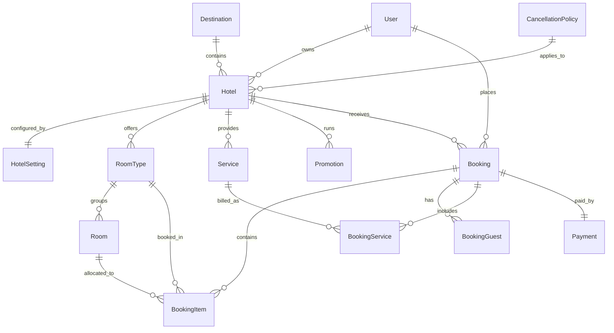

# StaySuite ERP 🏨

[](https://laravel.com)
[](https://php.net)
[](https://react.dev)
[](https://filamentphp.com)
[](https://stripe.com)
[](https://pestphp.com)
[](https://github.com/laravel/pint)

**StaySuite ERP** is a modern, enterprise-grade Multi-Tenant Hotel Management & Reservation ERP platform. Built to demonstrate high-performance web engineering, it features a decoupled architecture with a robust **Laravel 13 REST API**, a **React SPA frontend** using type-safe **TanStack Router/Query**, and a **Filament PHP** administration panel.

The platform is designed to handle complex business rules, concurrent database transactions, real-time inventory management, custom cancellation policies, dynamic promotion logic, and Stripe payment flows.

---

## 🌟 Architecture & Tenancy Model

StaySuite uses a multi-tenant business model where independent hotel owners operate as separate tenants. 

```
                                  +-----------------------+
                                  |      Super Admin      |
                                  | (Full Platform Scope) |
                                  +-----------+-----------+
                                              |
                                              v
                                  +-----------------------+
                                  |    Hotelier Tenant    |
                                  | (Single Hotel Scope)  |
                                  +-----------+-----------+
                                              |
                                              v
                              +---------------+---------------+
                              |                               |
                              v                               v
                     +-----------------+             +-----------------+
                     | Rooms/Inventory |             | Bookings/Guests |
                     +-----------------+             +-----------------+
```

### Roles & Access Control
Using **Spatie Laravel Permission**, access scopes are divided into three primary user groups:
1. **Super Admin**: Full oversight of platform settings, system-wide transaction reports, global commissions, and tenant management.
2. **Hotelier (Tenant)**: Manages their individual hotel profile, room catalog, inventory statuses, custom cancellation policies, dynamic promotions, local services, bookings, and payments.
3. **Customer**: Searches hotels/destinations, makes reservations, processes payments via Stripe Checkout, manages bookings, and handles self-service cancellations.

---

## ⚙️ Technical Highlights

### 1. Pessimistic Concurrency Locking
To prevent double bookings and race conditions during high-volume checkouts, the booking service implements atomic database transaction locking (`lockForUpdate`). This serializes concurrent checkouts targeting the same room category:
```php
$availableRooms = Room::where('room_type_id', $roomTypeId)
    ->where('status', RoomStatus::AVAILABLE)
    ->whereNotIn('id', $bookedRoomIds)
    ->lockForUpdate()
    ->get();
```

### 2. Custom Cancellation Policy Engine
Each hotel tenant defines its own `CancellationPolicy` determining:
- **Free Cancellation Window**: The number of days before check-in that a booking can be cancelled for free.
- **Penalty Calculation**: Automated assessment of cancellation fees (e.g. percentage of total reservation amount) if the cancellation occurs outside the free window.

### 3. Idempotent Stripe Webhook Handling
The `StripeWebhookController` verifies incoming webhook signatures using Stripe SDK. To prevent double processing, it relies on database-level idempotency checks:
- Saves Stripe `checkout.session.completed` events, updating booking status to `confirmed` and creating a transaction log.
- Handles `charge.refunded` events to cancel bookings and register refunded statuses automatically.

### 4. Dynamic Promotion & Pricing Engine
Supports scoped percentage and flat-rate discounts. Promotions automatically validate notice dates, active statuses, and only deduct from the base room rate (excluding taxes and platform commission fees).

---

## 📊 Database Entity Relationship Model (ERD)

The database schema utilizes strict foreign key constraints, cascade operations, and database indexes on key fields like booking references and slug indices.



---

## 💻 Tech Stack

### Backend API (Laravel 13)
* **Framework**: Laravel 13 (running on PHP 8.3/8.5)
* **Authentication**: Token-based API authentication via **Laravel Sanctum**
* **Security & Auth**: Role-Based Access Control (RBAC) via **Spatie Laravel Permission**
* **Payment Gateway**: **Stripe PHP SDK** with full webhook validation
* **Validation**: Highly specific Form Requests & Eloquent API Resources
* **Developer Tools**: **Laravel Boost** (agentic tooling), **Laravel Pail** (interactive log tailing), and **Laravel Pint** for automated styling compliance.

### Admin Panel (Filament PHP)
* **Framework**: **Filament PHP v3**
* **Tenant Panel**: Scoped to individual hotel records. Allows hoteliers to configure settings, view dashboard statistics, and manage rooms/bookings without data cross-exposure.

### Frontend Client (React SPA)
* **Library**: React 18
* **Routing**: **TanStack Router** (fully type-safe routing and loader prefetching)
* **Data Fetching**: **TanStack Query** (efficient state synchronization, query caching, and mutations)
* **Form Validation**: **Zod** schema validation integrated with React Hook Form
* **Styling**: **Tailwind CSS v4** featuring modern variables, utility styling, and sleek responsive grids

---

## 🔌 API Documentation Summary

### Authentication Routes
* `POST /api/auth/register` - Create a customer/hotelier user account.
* `POST /api/auth/login` - Authenticate and retrieve Sanctum API Bearer Token.
* `POST /api/auth/logout` - Invalidate active API tokens (Requires Sanctum).
* `GET /api/auth/me` - Retrieve current logged-in user profiles (Requires Sanctum).

### Public Resources
* `GET /api/v1/destinations` - View all available travel destinations.
* `GET /api/v1/hotels` - List and filter hotels by destination, query tags, and amenities.
* `GET /api/v1/hotels/{hotel}` - Fetch details of a specific hotel including room types.
* `GET /api/v1/amenities` - List global hotel amenities.

### Reservations & Stripe Checkout (Requires Sanctum Token)
* `POST /api/v1/bookings` - Submit reservation payload (allocates rooms atomically).
* `GET /api/v1/bookings/{booking_ref}` - Review reservation summary and booking details.
* `POST /api/v1/bookings/{booking_ref}/cancel` - Request reservation cancellation.
* `POST /api/v1/bookings/{booking_ref}/checkout-session` - Retrieve a Stripe Checkout URL for payments.

### Webhook Gateways (Public Callback)
* `POST /api/v1/payments/webhook/stripe` - Handles incoming Stripe Checkout payment notifications.

---

## 🛠️ Setup & Installation

### Prerequisites
* PHP 8.3 or PHP 8.5
* Node.js v20+ and NPM
* Composer
* Local database (MySQL, PostgreSQL, or SQLite)
* Stripe account credentials (for Stripe Checkout)

### Backend Installation

1. **Clone the Repository**
   ```bash
   git clone https://github.com/YOUR_USERNAME/staysuite-erp.git
   cd staysuite-erp
   ```

2. **Install Dependencies**
   ```bash
   composer install
   npm install
   ```

3. **Configure Environment Variables**
   Copy the example environment file and fill in your DB and Stripe settings:
   ```bash
   cp .env.example .env
   ```
   Add your Stripe credentials inside `.env`:
   ```env
   STRIPE_KEY=pk_test_...
   STRIPE_SECRET=sk_test_...
   STRIPE_WEBHOOK_SECRET=whsec_...
   ```

4. **Initialize Application**
   Generate keys, run database migrations, and seed default roles:
   ```bash
   php artisan key:generate
   php artisan migrate --seed
   ```

5. **Start Dev Servers**
   Run the concurrent dev command (serves site, Vite assets, and queues):
   ```bash
   composer run dev
   ```

---

## 🧪 Testing

The codebase maintains a robust test suite written using **Pest PHP v4** covering validation rules, concurrency limits, booking cancellations, and payment processing:

To run tests locally:
```bash
php artisan test
```

To run tests with compact output reporting:
```bash
php artisan test --compact
```
